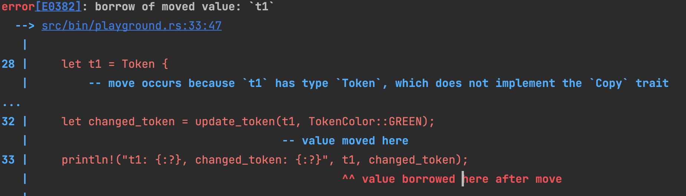

# Derive
rust一路寫來都會給人一種非常節制且保守的風格, 能不多給功能就不多給功能.這幾個好夥伴幾乎可以說是幾乎是在寫code一開始就必須要用到的.


- Clone, to create T from &T via a copy.
- Copy, to give a type 'copy semantics' instead of 'move semantics'.
- Hash, to compute a hash from &T.
- Default, to create an empty instance of a data type.
- Debug, to format a value using the {:?} formatter.

我們嘗試實現一個函數來更新Token的狀態, 一個隨意自定義的data structure.

```rust
pub enum TokenColor {
    RED ,
    GREEN
}

pub enum Size {
    BIG,
    MID
}

pub struct Token {
    color: TokenColor,
    size: Size,
}

fn update_token(token: Token) -> Token {
    let mut token = token;
    token.color = TokenColor::GREEN;
    token.size = Size::BIG;
    token
}

fn main() {
    let t1 = Token {
        color: TokenColor::RED,
        size: Size::BIG,
    };
    let changed_token = update_token(t1, TokenColor::GREEN);
    println!("t1: {:?}, changed_token: {:?}", t1, changed_token);
}
```
# Debug
這將會是所有最早必須加入的 trait. 連print都不print不出來就很難繼續開發. 
有三個place holder 可以用來print出來, 
- `{}`
- `{:#?}`
- `{:#?}`

`{:?} /{:#?}` 放在string裡頭會呼喚`Debug` trait, 這個trait會將所有的field print出來. 但是後者是pretty print, 對於較大得struct會比較好看.
`{}` 放在string裡頭會呼喚`Display` trait, 這個trait會將所有的field print出來. 

```rust
fn main(){
    let my_number = {
        let second_number = 8;
        second_number + 2
    };
    // println!("my_number: {}", my_number); <====這個會噴錯
    println!("my_number: {:?}", my_number); //<=== 這個怎可以正確print出我們想要得結果
}
```
編按:
    Debug 出來的information並不會因為release或一般build code有所差異. 我覺得debug是相對於display, 允許更多樣var type被印出來

```rust
#[derive(Debug)]
pub struct Token {
    color: TokenColor,
    size: Size,
}
```
對於我們要處理的struct, 我們可以使用`#[derive(Debug)]`來讓他自動實現Debug trait. 這樣我們就可以直接print出來了.   嗎？其實
這樣還不夠因為.所有子filed都要是可以debug的struct. 這樣就會有一個問題, 我們的TokenColor和Size都需要冠上Debug trait. 這樣就會變成這樣

```rust 
#[derive(Debug)]
pub enum TokenColor {
    RED ,
    GREEN
}
#[derive(Debug)]
pub enum Size {
    BIG,
    MID
}
#[derive(Debug)]
pub struct Token {
    color: TokenColor,
    size: Size,
}

fn update_token(mut token:Token, render_color: TokenColor) -> Token {
    token.color = render_color;
    return token
}

fn main() {
    let t1 = Token {
        color: TokenColor::RED,
        size: Size::BIG,
    };
    let changed_token = update_token(t1, TokenColor::GREEN);
    println!("t1: {:?}, changed_token: {:?}", t1, changed_token);
}
```


# Copy
之前ownership段落有談論關於 clone 和 copy 的不同. 那我們實際上來看一下我們Why need this trait?


由於ownership的規定. 一個變數進出block (通常是function) 所需的身分經常會有變化. 最暴力無腦的解法就是傳出去的object是複製品. 
一但我們對 Token, TokenColor, Size 加上copy trait後, 我們就可以直接傳出去了. 

```rust
#[derive(Debug,Copy)]
pub enum TokenColor {
    RED ,
    GREEN
}
#[derive(Debug,Copy)]
pub enum Size {
    BIG,
    MID
}
#[derive(Debug,Copy)]
pub struct Token {
    color: TokenColor,
    size: Size,
}

fn update_token(mut token:Token, render_color: TokenColor) -> Token {
    token.color = render_color;
    return token
}


fn main() {
    let t1 = Token {
        color: TokenColor::RED,
        size: Size::BIG,
    };
    let changed_token = update_token(t1, TokenColor::GREEN);
    println!("t1: {:?}, changed_token: {:?}", t1, changed_token);
}
```

# Hash
當你需要一些共通功能的時候必需要,舉個實際的例子.在筆者實現遊戲的過程中. 會遇上需要比對兩個棋盤是否一致的問題


