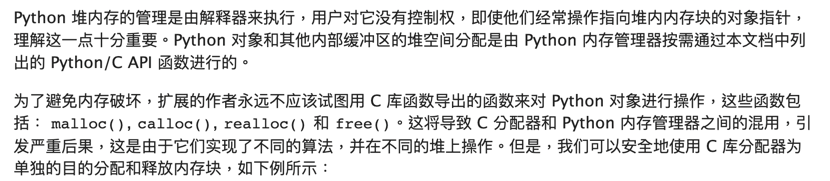

# Garbrge collection

身為一個近代 python / java script 程序員. 
估計80％使用場景沒有手動回收過變數吧

但應該大部分的人都知道變數作用範圍.

```python
def dummy_fn():
    will_die = 0

dummy_fn()
print(will_die) # 這個絕對會GG
```
Python 對於內存的管理走的就是自動garbege collection. 在官方文件中有註解.


基本不推薦直接去操作以免造成stackoverflow.和各式各樣的memory處理問題.


## Stack memory
這個好解釋. 所有固定大小的東西都可以存在這個地方. 包含程式碼以及諸多靜態資料.

## Heap memory
動態可能在runtime才會知道的東西. 要多少才創造多少空間. 例如以python的list為例. 
所有原生python工程師可能沒有發覺default的儲存格式居然可以完全動態宣靠吿而且不用統一格式. 是一個多麽方便和神奇的的發明, 但也因為如此, 每個list其實都是存放pointer並且指向不保證連續的heap memory空間.


# 跟Rust 有啥關係?
首先, 大致上把 memory allocation的策略大致是切成三種. **純手動** , **GC**, **Rust**
沒辦法, rust在這點上獨樹一格. 從這個角度上來說rust不是一個**更快**的語言. 而是完全不同的解題思路.

WARNNING! 以下為個人解讀.

以各式各樣教程, 官方文件裡. 在rust 最基礎的存處都是希望可以利用array. 一個fixed length的存儲方式. 
