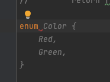
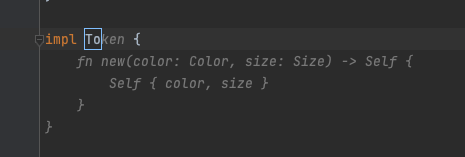
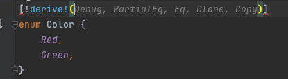
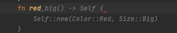
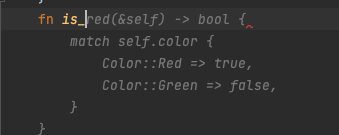

# How to learn fast?
在介紹這麼多語法概念之後，筆者認為是時候來~~水~~一篇XDD.

我們面向的文章對象一直是第二程式語言的人, 畢竟rust作為第一個語言學習真的價值不大.

 - 提升自己的動機

    當初為什麼會選擇開始學習rust. 其實是看到同事presentation, 分享rust的特點. 這個滿足了動機的一部分 `有人分享&討論` . 對於任何新知識領域的探索都必須要找人一起前進. 一來是社交壓力, 二來是假想如何教導別人的過程可以幫助知識的個人化.
 - 想出具體可落地的project

    這個是我個人的經驗, 一開始我們會想到的是寫一個簡單的web server. 但是這個對於初學者來說, 會有很多的問題. 但我們都不初學者對吧？～ 舉個筆者自己的例子, 作為後端的工程師, 可以就自己熟悉的backend 框架去做一個小規模的應用. 體會看看 rust 有多神奇和難寫.
 
 - 千萬不要好高騖遠直接聖經本
    
   這個比較偏見仁見智． 但足夠小的學習曲線.把巨大的階梯劃分成足夠小的階梯. 才有辦法做到一個現代人都需要學習的課題
   >利用零碎的時間完成完整的事情, 而不是利用完整的時間做零碎的事情
   
    這邊順便推薦一下這個[YT](https://www.youtube.com/c/LetsGetRusty), 雖然滿多內容是被官方文件重新演繹. 但絕對可以拯救注意力不足的人.

# Copilot

這邊得推薦一下這個神奇的工具和正確地開啟姿勢. 

不知道大家有沒有練習過寫英文文章?
幾乎所有老師都會建議直接撰寫英文，因為先寫中文再翻譯成英文經常會有文化誤用的部分. 例如你幾乎很難正確的翻譯`孝順`.
而且寫英文也是正確的建立英語思考的mind set. 

然而程式語言不盡然相同於這點, 當然每個程式語言都會有屬於自己的特型, 也絕對不應該直接翻譯. 但學了多個程式語言後, 你會發現核心需要探索的大概是不同之處, 而不是 for迴圈分號怎麼放.
Copilot就可以起到一個很神奇的作用. 將你熟悉的語言8成翻譯成你想要的模式.

我這裡舉個 python -> rust的例子

``` python
class Color(Flag):
    RED = True
    GREEN = False

class Size(IntEnum):
    BIG = 3
    MID = 2
    SMALL = 1


class Token:
    def __init__(self, color: Color, size: Size):
        self.color = color
        self.size = size
    def __str__(self):
        return f'color: {self.color.name}, size: {self.size.name}'
```

講python程式碼作為註解貼到  xxx.rs 的檔案中. 在寫入`enum`關鍵字後, 你就可以看到copilot的神奇之處.



Copilot 可以幫你快速的parsing 內容. 當然這也不是自動駕駛. 我們慣常必須使用到的derive 並沒有直接跳出.
我們有點像是給定關鍵字快速在網路上搜尋和複製上別人的sample code.



不只如此, copilot很有很強的 naming convention 訓練效果. 
假設我們這邊想要一個判斷是不是紅色token的function. 


上面那樣的提示 copilot沒辦法從github找到跟你一樣 naming+意圖的人.



當我們換成慣常的命名方式後, copilot就可以很快的找到相似的人. 這邊我們可以看到他幫我們把`is_red`的function寫好了.
而且這邊可以注意到copilot是用 match 而非 if/else. 這也是大部分rust programmer的習慣.
