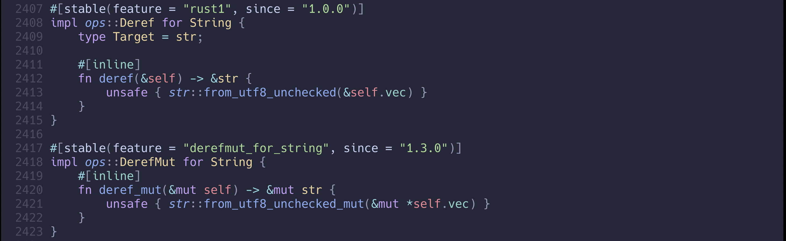
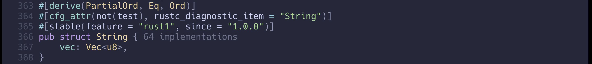
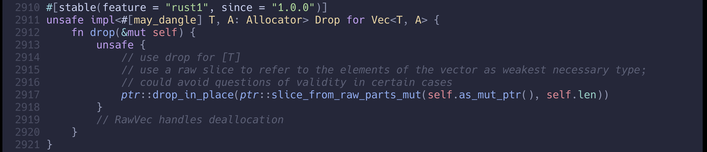

在Rust中，類似陣列的基本資料結構有分三種

- Array
- Vec
- HashMap


### Array
就跟Python的**List**，或是Javascript的**Array**差不多。但不一樣的地方在於，儲存在Rust的Array中的資料類型必須是一致，如果儲存的是 `i32` 類型就不能有 `char` 類型，相反如果是 `char` 類型就不能有 `i32` 類型，並且一旦建立後就不能再修改裡面的數值，因為Rust的Array是儲存在`Stack`上。
只有 **在編譯過程中知道資料類型大小是固定不變** 這種的資料類型才可以被儲存在 **Stack** 。

```
fn main() {
    let a: [i32; 3] = [1, 2, 3]; // 在宣告時就必須定義好Array裡的資料型態還有數量
}

```

### Vec
在實際情況中，每次使用 **Array** 的邏輯當然不可能數量都一樣，這時候就需要 **Vec** 資料類型。
因為每次的數量不一定，也就是資料大小不一定，因此 **Vec** 的資料是儲存在 **Heap** 中。
與 **Array** 一樣，儲存在 **Vec** 資料型態必須都是同一種類型。

下面簡單的介紹基本用法。
```
fn main() {
    let a: Vec<i32> = vec![1, 2 ,3];
    println!("{:?}", a); // [1, 2, 3]

    let mut b: Vec<i32> = vec![1, 2 ,3];
    b.push(4);
    println!("{:?}", b); // [1, 2, 3, 4]

    let mut c: Vec<i32> = vec![1, 2 ,3];
    c.remove(1); // by index
    println!("{:?}", c); // [1, 3]

    let mut d: Vec<i32> = vec![1, 2 ,3];
    d.pop();
    println!("{:?}", d); // [1, 3]

    let e: Vec<i32> = vec![1, 2 ,3];
    for i in e.iter() {
        println!("{}", i);
    }// 1 2 3
}
```

### HashMap
就跟 **Vec** 一樣，我們無法在編譯時知道值的大小，所以會將資料儲存在 **Heap** 上，但與 **Vec** 不同的地方在於，必須引入 HashMap的 **library** : `use std::colelctions::HashMap`。在宣告時一樣必須定義 `key` & `value`的資料類型。
```
use std::collections::HashMap;
fn main() {
    let mut hash_map: HashMap<String, u32> = HashMap::new();
    hash_map.insert(String::from("a"), 1);
    hash_map.insert(String::from("b"), 2);
    println!("{:?}", hash_map); // {"a": 1, "b": 2}

    hash_map.remove("a");
    println!("{:?}", hash_map); // {"b": 2}

    if !hash_map.contains_key("c") {
        println!("can not found key c"); // can not found key c
    }

    let mut hash_map2: HashMap<i32, i32> = HashMap::new();
    hash_map2.insert(1, 11);
    hash_map2.insert(2, 22);
    hash_map2.insert(3, 33);

    for (k, v) in hash_map2 {
        println!("{k}: \"{v}\"");
    }

    // 當有初始值也可以在不用刻意標示資料類型，編譯器會檢查
    let solar_distance = HashMap::from([
        ("Mercury", 0.4),
        ("Venus", 0.7),
        ("Earth", 1.0),
        ("Mars", 1), // error| mismatched types expected floating-point number, found integer
    ]);

    println!("{:?}", solar_distance);
}

```


### Box
在介紹Box之前先來了解什麼是 **智能指針(smart pointer)** 。
所謂的智能指針與一般指針的差別就在於除了指向數值資料以外，還有提供額外的功能。舉個例子 `String` 與 `&str` 都是將指針指向 **Heap** 中，但 `String` 多了 `Deref` 的功能，當我們 **解構(Deref)** 時會得到 `&str`。


`String` 是以 `Vec`為基礎的結構體，這邊可以看到 `Vec` 實作 `Drop`的功能。 



可以發現符合以下規則的就是 **智能指針**
 - 對值擁有 **所有權**
 - 實作 **Deref** / **DerefMut** / **Drop**

因此 `String` 和 `Vec` 以及 `Box`等資料類型都是屬於 **智能指針**。

```
fn main() {
    let a = "box";
    let b: Box<&str> = Box::new("box");

    assert_eq!(a, b); // error| can't compare `&str` with `Box<&str>`
    // 當想要實際取出值時需要使用 `*` 來解引用
    assert_eq!(a, *b);
}
```
