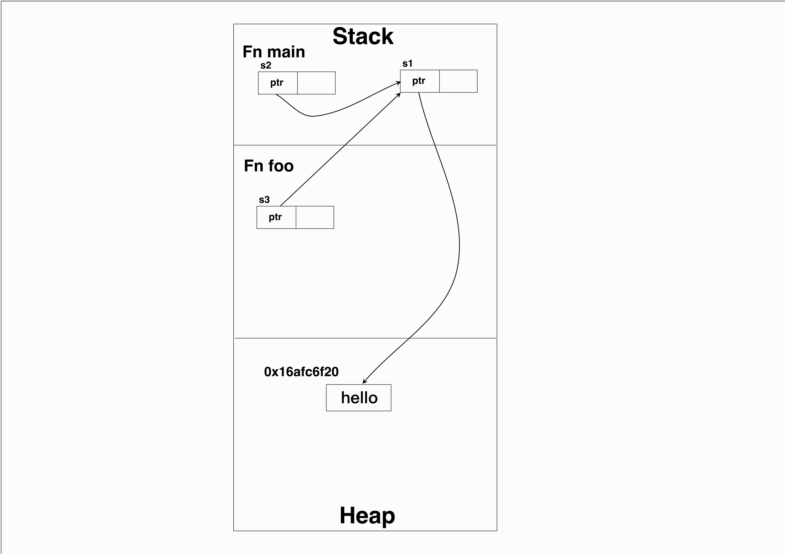
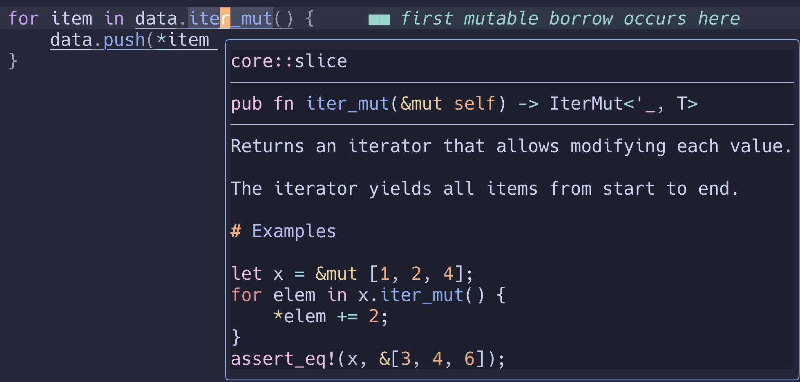
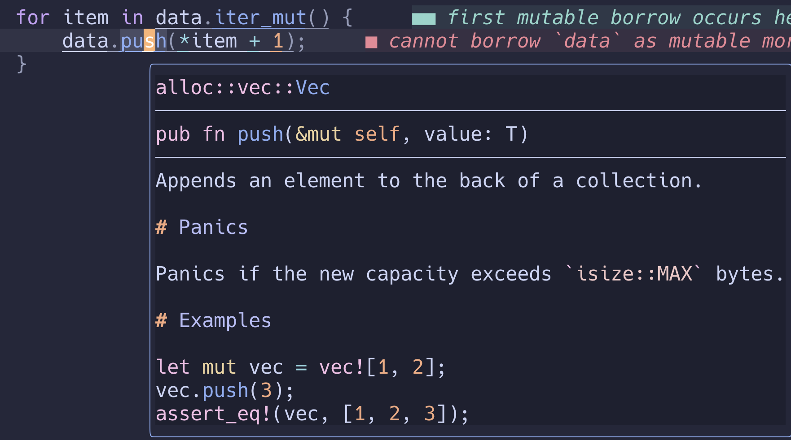

## Borrow

上一篇Ownership我們講到，當我們給予變數值或是傳遞給函式的時候，若資料結構可以使用Copy trait會複製一份數據，如果不能，則會使用Move，原來的變數就不能夠繼續使用。
這帶來了不方便的地方，當我們希望值的所有權不被轉移，但又能被其他函式所用該怎麼做呢？這時候**Borrow(借用)**的功能派上用場了。

就像上面所提到**借用**的概念是允許一個值的所有權在不發生轉移的情況下，可以被其他變數或函式所使用。可以透過`&`或 `&mut`來實現。

也就是說一個值可以有多個對象可以對其進行**讀**，原則上所有的對象只是**臨時借用了使用權**並不影響`同時間只能有一個擁有者`這條規則。

在預設的狀況下，借用只能是讀不能寫入。因此當我們不想**Copy**或是**Move**時就可以使用**借用**。

```
fn main() {
    let s1 = String::from("hello");
    let s2 = &s1;

    println!("value address, s1: {:p}, s2: {:p}", &s1, s2); // s1: 0x16afc6f20, s2: 0x16afc6f20
    println!("ref address, s1: {:p}, s2: {:p}", &&s1, &s2); // s1: 0x16afc6ff0, s2: 0x16afc6f38

    foo(&s1);
}

fn foo(s3: &String) {
    println!("value address, s3: {:p}", s3); // s3: 0x16afc6f20
    println!("ref address, s3: {:p}", &s3); // s3: 0x16afc6e40
}
```

這邊可以看到s1, s2, s3都有各自引用的記憶體位置，但指針都指向同一筆資料。
雖然**hello**有很多指針指向它，但它的擁有者只有一個，因此值是可以被複數引用。



### 可變引用
剛才有提到，預設中借用只能是讀，那如果我們想修改引用的值呢？這時只需要在**&**後加個**mut**就可以修改了**&mut**。

```
fn main() {
    let mut s1 = vec![1];
        
    foo(&mut s1);
    println!("{:?}", s1);// [1, 2]
}

fn foo(s2: &mut Vec<i8>) {
    s2.push(2);
}
```


但是在同一個作用域同一個變數不能有多個可變引用
```
fn main() {
    let mut s = String::from("hello");
    let s1 = &mut s; // first mutable borrow occurs here
    let s2 = &mut s; // second mutable borrow occurs here

    println!("{}, {}", s1, s2); // first borrow later used here
}

```
`error[E0499]: cannot borrow `s` as mutable more than once at a time`

為什麼會有這些限制呢？因為要避免資料競爭(data races)。

舉個例子**迭代失效(Iterator invalidation)**

```
fn main() {
    let mut data = vec![1, 2, 3];

    for item in data.iter_mut() { // first mutable borrow occurs here
        data.push(*item + 1); // second mutable borrow occurs here
    }
}
```
當在遍歷data的時候，又持續往data裡新增資料，會造成死循環導。
**data.iter_mut**方法是**&mut**，**data.push**也是**&mut**，在同作用域有多個可變引用，因此編譯器過不了。




我們可以用Python來體驗一下死循環的迭代

```
if __name__ == "__main__":
    data = [1]
    for item in data:
        data.append(item + 1)
        print(item)
```


還有另一種情況是如果引用了已經被釋放掉的值會怎麼樣呢？
```
fn main() {
    let s = 10;
    let s1 = foo(s);
}

fn foo<'a>(s: i32) -> &'a i32 {
    let s2 = s + 1;
    &s2 // error[E0515]: cannot return reference to local variable `s2`
}
```

可以發現我們無法回傳**引用**在函式中建立的變數。Rust在作用域結束後會自動Drop釋放所有在作用域中建立的變數，因此當**s1**拿到**foo()**回傳的**s2**引用時，**s2**已經被釋放掉了。

讓我們來整理一下重點：
1. 當第一個不可變引用出現到所有不可變引用的作用域結束之前，都不能出現有**使用的(被修改)**可變引用。
2. 一個值可以有多個**只讀**引用
3. **引用**存活時間不能超過**被引用**的存活時間
