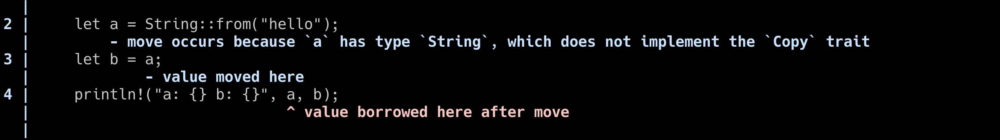
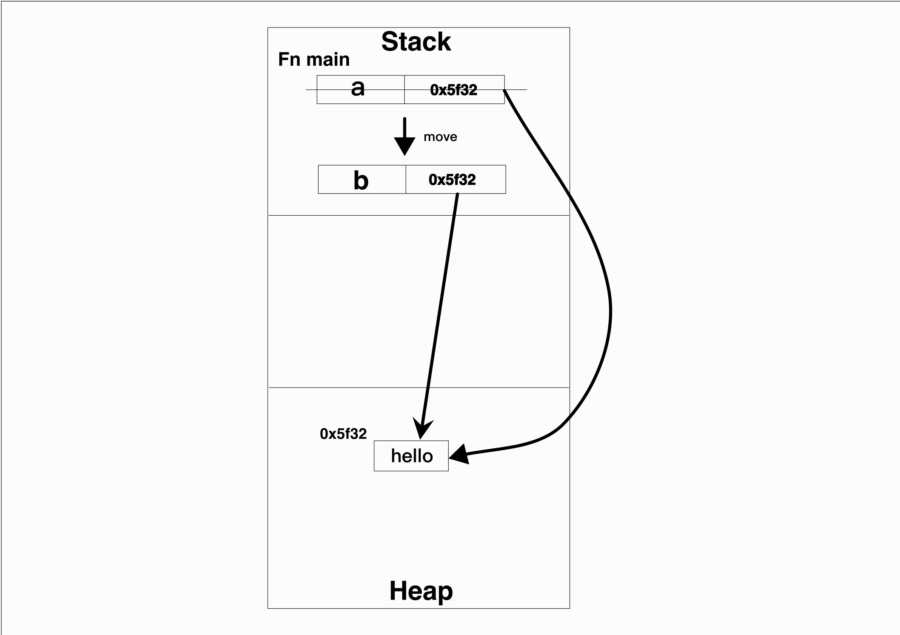

## Ownership

當電腦上的動態記憶體不再被使用時，應該要被釋放出來。每個語言都有自己管理記憶體的方式。
- C/C++: 手動管理
- Go/Java/Python: 使用Garbage Collection
- Rust: Ownership

以下表格為比較各個記憶體管理機制的優劣:

| | Pros | Cons |
| ----------- | ----------- | ------ |
| Garbage Collection | - Error free <br> - faster write time <br> | - No control over memory <br> - Slower and unpredictable runtime performance <br> - Large program size|
| Manual memory managemant| - Control over memory <br> - Faster runtime <br> - Smaller program size | - Smaller program size <br> - Slower write time|
| Ownership model | - Ownership model <br> - Error free <br> - Faster runtime <br> - Smaller program size | -Smaller program size |


為什麼Rust不跟Python, Go一樣使用GC呢？**Slower and unpredictable runtime performance**是很重要的一個原因。
對於遊戲玩家來說，語言延遲是很討厭的一件事。[Discord switch rust from go](https://discord.com/blog/why-discord-is-switching-from-go-to-rust)，從文章中可以得知，Discord的伺服器每兩分鐘會有一個spikes，而這個原因是Go的記憶體管理方式所造成的。

Ownership/Borrowing/Lifetime是Rust中非常重要的概念，也是Rust的基礎。
因為有些概念所以不需要Garbage collection來回收記憶體，並確保記憶體的安全性。

### Ownership 的規則
1. 每個數值(value)都會有一個變數作為它的擁有者（owner）
2. 同時間只能有一個擁有者
3. 當擁有者離開作用域時，數值就會被丟棄

先來看第一個例子:
```
fn main() {
  let a = 2;
  let b = a;
  println!("a: {} b: {}", a, b);
}
```
我們知道當一個數值所有權被轉移後，原來的變數就不能再使用該數值。然而有**trait**可以改變這個行為，它叫做**Copy**。簡單來說，當**x = y**發生時若**y**是可以被copy impl的話就會自動使用copy trait。
[詳細關於trait](https://doc.rust-lang.org/std/marker/trait.Copy.html)


第二個例子:
```
fn main() {
    let a = String::from("hello");
    let b = a;
    println!("a: {} b: {}", a, b);
}
```


執行後卻發現編譯不過，原因是因為**String**的資料是儲存在Heap(堆積)上面而不是Stack(堆疊)上，並且**String*類型無法使用copy trait。

當Rust知道要賦予的數值是儲存在Stack上，就直接Copy一份到新的變數上。
但如果是Heap上Copy一份一樣的數據花的代價太大，所以當b要等於a的值的時候，賦予的其實是指向Heap資料的pointer。
還記得Ownership的第一條規則嗎？**同時間只能有一個擁有者**，"hello"這個數據的擁有者從a轉移到b身上，因此無法再繼續使用a變數了。




當變數傳到函式中也會發生一樣的行為。
```
fn main() {
    let a = String::from("hello");
    let b = test(a); // value "hello" move here
    println!("a: {}, b: {}", a, b); // borrow of moved value a
}

fn test(i: String) -> String {
    i
}
```

```
fn main() {
    let a = 32;
    let b = add_one(a);
    println!("a: {}, b: {}", a, b); // a: 32, b: 33
}

fn add_one(i: i32) -> i32 {
    i + 1
}
```

### 作用域
變數的作用域(scope)，就是變數的**有效範圍**，在該作用域內宣告的變數就只能在該作用域使用，當離開作用域時變數就會被丟棄。

```
fn main() {
    let a = 32;

    {
        let b = 2;
    }

    println!("a: {}", a); // a: 32
    println!("b: {}", b); // cannot fund value b in this scope
}
```

**if**也是作用域的一個範圍
```
fn main() {
    let a = 32;

    if a > 1 {
        let b = 123;       
    }

    println!("a: {}", a); // a: 32
    println!("b: {}", b); // cannot fund value b in this scope
}
```
