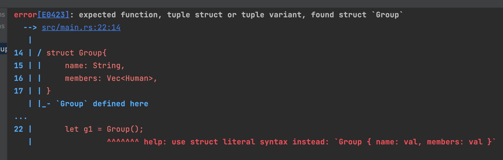

# Project Struct - Trace code 入手點
Rust有一個特點就是 你最簡單的方式是從 project root的`main.rs` main function 作為入口位置開始運行程式碼. 這是基於 cargo project的convention.
以下是一是 cargo 提出的 project struct：
```
.
├── Cargo.lock
├── Cargo.toml
├── src/
│   ├── lib.rs
│   ├── main.rs
│   └── bin/
│       ├── named-executable.rs
│       ├── another-executable.rs
│       └── multi-file-executable/
│           ├── main.rs
│           └── some_module.rs
├── benches/
│   ├── large-input.rs
│   └── multi-file-bench/
│       ├── main.rs
│       └── bench_module.rs
├── examples/
│   ├── simple.rs
│   └── multi-file-example/
│       ├── main.rs
│       └── ex_module.rs
└── tests/
    ├── some-integration-tests.rs
    └── multi-file-test/
        ├── main.rs
        └── test_module.rs

```
## bin
如果我需要有多個進入點？ 

這時候可以將不同的 .rs file 置放於 src/bin/之下 `cargo run --bin named-executable`  來執行

## examples
這個地方幾

## test
這個地方是擺放 End-to-End test的地方. 如果是unit test會直接放在所屬src的.rs檔案中. 後面的文章會詳細的說明該怎麼寫測試.


# Compiler - Rust路上最大的敵人與朋友
這個幾乎可以說是rust這個語言很美妙也很痛苦的地方. 這邊僅展現一個對陌生語言正確衝鋒的態度.
舉個例子來説:
```rust
struct Human{
    name: String,
    age: u8,
}

struct Group{
    name: String,
    members: Vec<Human>,
}

fn main() {
 let g1 = Group();
}
```
毫無意外的出現error. 這個compiler 相較其他語言的compiler給出了非常詳細的錯誤訊息以及建議修改的方式.



有兩個特別的重點:
1. E0423 這個error code. 往常最基本上找尋error message都是透過搜尋關鍵字. 但這邊有官方維護的error code, 對於
2. ^^^^^^ 的提示內容. 提供更詳細直接的try的方法.


# 奇雞連連(Gobblet)
這30天的鐵人賽範例會圍繞打造一個[桌遊](https://boardgamegeek.com/boardgame/2266/gobblet#:~:text=Gobblet%20is%20an%20abstract%20game,start%20nested%20off%20the%20board.)-> 奇雞連連的單人遊戲服務.

為了能夠讓讀者可以一起想像如何建模, 掌握這個規則簡單但是變化性豐富的遊戲是必須的. 以下會用程式需要的方式介紹這個遊戲


遊戲可以想像作為*圈圈叉叉* 的升級版. 但是有一些不同的地方.
`雙方`各自有`三種大小`的棋子, 每個大小總共有`2個`
可以在棋盤上任意的放置. 但是一個棋子只能放在比他小的棋子上面. 
例如一個大的棋子只能放在中的棋子上面, 一個中的棋子只能放在小的棋子上面. 
空的地方則可以任意放置.

和一般最圈圈叉叉最大不同的地方在於. 我們可以從棋盤上拿走自己顏色的棋子放置到棋盤上其他合法的位置, 但是這個行動並不是一個atomic的結果, 如果在拿起的瞬間造成對方勝利, 則這個行動視為輸了遊戲.

[YT的教學](https://www.youtube.com/watch?v=G-ndITTiHG0&ab_channel=%E5%8B%83%E6%A0%B9%E5%9C%B0%E6%A1%8C%E9%81%8ABoardGameLeisure)

