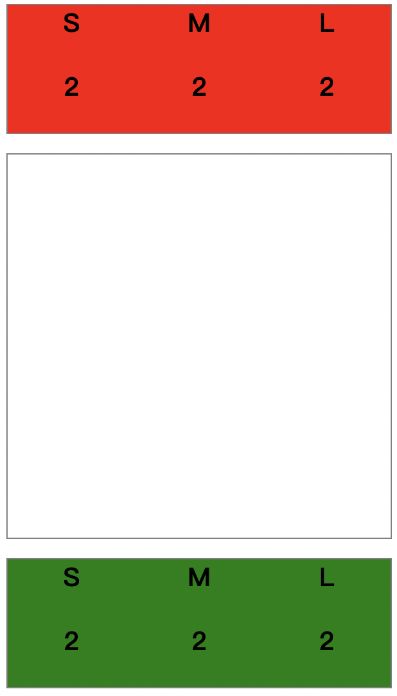

我們使用React框架來實作遊戲，為什麼要選這個呢？只是因為筆者公司使用的是Vue，想用用看沒用過的。

根據奇雞連連的遊戲規則：
 - 兩個玩家，有 S, M, L 各兩個籌碼
 - 在九宮格的場地上放置
 - 不同玩家的旗子可以互吃，大小是L > M > S

 因此在前端的畫面我們預計會有上下兩個 `stack` 中間有個 `board`

```
<div>
  <Stack player="red" />
  <Board />
  <Stack player="green" />
</div>
```


接下來會使用React提供的 `Memo` 功能來記錄遊戲的所有資訊，玩家籌碼數量、場上旗子的狀態。

```
red = { "S": 2, "M": 2, "L": 2 };
green = { "S": 2, "M": 2, "L": 2 };

board = [
  [
    {
      "tokens": ['', '']
    },
    {
      "tokens": ['', '']
    },
    {
      "tokens": ['', '']
    }
  ],
  ...
]
```

說到遊戲操作方面筆者使用的是 [React DnD](https://react-dnd.github.io/react-dnd/about)  `React DnD` 也就是 Drag and Drop，來進行拖拉的操做，這個extension提供了非常好用的事件來達成我們要的目的。

```
const [{ isDragging }, drag, preview] = useDrag(
  () => ({
    type: ItemTypes.KNIGHT,
    item: { 
      from: "board",
      x: x,
      y: y
    },
    canDrag: () => game.canDragTargetFromBoard(x, y),
    collect: (monitor) => ({
      isDragging: !!monitor.isDragging(),
      item: monitor.getItem(),
    }),
  }),
  [],
)
```

上面可以看到當我們在一個component使用 `Drag` 功能時我們可以定義 `canDrag` 白話文就是 `可不可以拖拉`，這邊的情境是 `canDragTargetFromBoard` 也就是在九宮格上的拖拉可不可行，當格子上沒有棋子時是不能拖拉的。因此我們可以這樣寫。

```
canDragTargetFromBoard(x, y) {
  let targetPlayer = this.board[y][x]['tokens'][0];
  if (targetPlayer) {
    return true;
  }
  return false;
}
```

反之如果是從籌碼拿出棋子的狀況下，什麼情況不能拖拉呢？就是當籌碼沒了的時候。
```
canDragTargetFromStack(player, size) {
  if(this[player][size] == 0) {
    return false;
  }
  return true;
}
```

當然除了Drag事件以外，還有Drop放下時的事件可以定義。
籌碼的地方 `canDrop` 一律 `false` 沒什麼問題，那九宮格的地方什麼樣的狀況不能放呢？

```
// 格子沒有棋子時
if (!targetSize) {
  return true;
}

// 格子裡的棋子跟準備放進去的棋子是同個顏色的
if (targetPlayer == fromItemPlayer) {
  return false;
}

let size = { 'S': 0, 'M': 1, 'L': 2 };

// 大小不對 ex: S想放到已經有M或L的格子裡
if (size[targetSize] >= size[fromItemSize]) {
  return false;
}

return true;
```

當棋子放下後還有也有事情要處理，可以用 `drop` 事件
如果是從籌碼拿出來就要在相對應的大小 `-1` ，如果是從九宮格就要把原本那格的資料移除，目標格子放資料。

```
whenDropTarget(item, toX, toY) {
  if (item['from'] === 'board') {
    let fromItem = this.board[item['y']][item['x']]['tokens'];
    this.board[toY][toX]['tokens'] = fromItem;
    this.board[item['y']][item['x']]['tokens'] = ["", ""];
  }

  if (item['from'] === 'stack') {
    this.board[toY][toX]['tokens'] = [item['player'], item['size']];
    let player = item['player'];
    this[player][item['size']] -= 1;
  }
}
```

完整的code可以到 [這裡](https://github.com/yogurt-company/Gobblet/tree/main/frontend) 觀看，因為時間關係code寫得蠻醜的希望大家見諒QQ。
