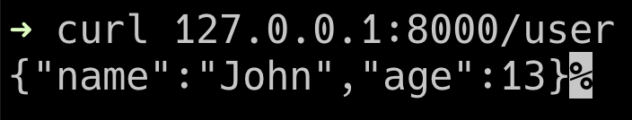
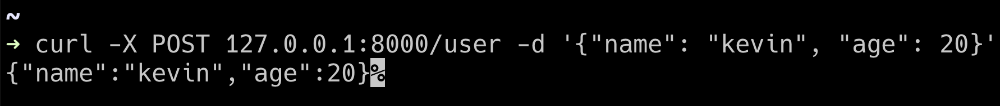
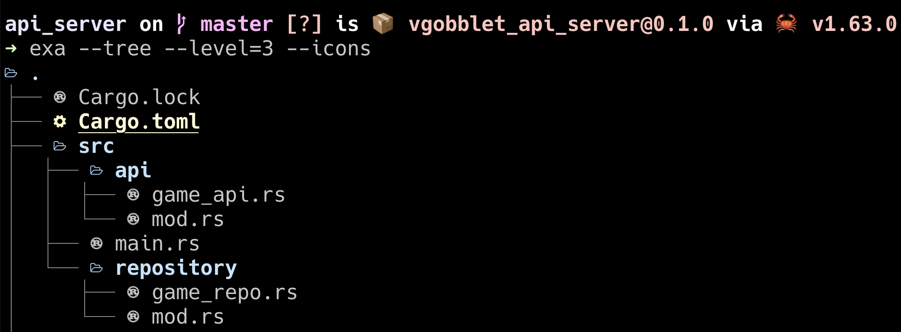

我們的目標是希望可以實作用網頁遊玩奇雞連連，因此我們會需要前端將遊戲資料發request到後端去處理遊戲的邏輯。可能是判斷這步棋合不合遊戲規則、遊戲結束了沒或是AI給出的下一步怎麼走。

這邊先來簡單的用Rocket做出可以 `get` & `post` 的api。

依照現代網頁框架的模式，所以我們需要一個 `controller` 當作路由，一個 `repository` 來處理遊戲邏輯。

我們會用到的是Rust的 `Module` 系統，也就是類似其他語言常見的 `namespace` 功能，這樣可以確保函式的名稱不會有衝突的問題，並且更好的分類各個 `Module` 在做的事情。

在 `src` 底下建立的資料夾都可以當作一個 `Module` ， 只要裡面含有 `mod.rs` 去宣告這個 `Module` 底下有哪些檔案就可以了。

先在 `$project/src` 底下新增一個叫 `api` 的資料夾，裡面有 `game_api.rs` & `mod.rs`。

`api/game_api.rs` :
```
use rocket::{serde::json::Json};
use crate::repository::game_repo;

#[get("/user")]
pub fn get_user() -> Json<game_repo::User> {
    let user = game_repo::get_user_data();
    Json(user)
}
```

`api/mod.rs`:
```
pub mod game_api;
```

`repository` 也是依樣畫葫蘆。

`repository/game_repo.rs`:
```
use rocket::{serde::Deserialize, serde::Serialize};

#[derive(Debug, Serialize, Deserialize)]
pub struct User {
    name: String,
    age: i32,
}

pub fn get_user_data() -> User {
    User {
        name: String::from("John"),
        age: 14
    }
}
```

`repository/mod.rs`:
```
pub mod game_repo;
```

接著在 `main.rs` 引入 `mod`:
```
#[macro_use]
extern crate rocket;

mod api;
use api::game_api::{get_user};


#[launch]
fn rocket() -> _ {
    rocket::build()
        .mount("/", routes![get_user])
}
```

接下來執行 `cargo run` & `curl 127.0.0.1:8000/user`:


在與網頁前端傳遞資料最常用的就是 `Json` 格式，`crate` 中有個 `serde` 是最多人使用的工具，一開始Rocket並沒有支援轉Json的工具，直到某個版本將這個crate直接加到內建裡。

再來是post的部分，先是 `repository/game_repo.rs`:
 ```
 pub fn set_user_data(user_info: Json<User>) -> User {
    User {
        name: user_info.name.clone(),
        age: user_info.age.clone()
    }
}
 ```

`api/game_api.rs`:
```
#[post("/user", data="<user_info>")]
pub fn set_user(user_info: Json<game_repo::User>) -> Json<game_repo::User> {
    let user = game_repo::set_user_data(user_info);
    Json(user)
}

```

`main.rs`:
```
#[macro_use]
extern crate rocket;

mod api;
use api::game_api::{get_user, set_user};

mod repository;

#[launch]
fn rocket() -> _ {
    rocket::build()
        .mount("/", routes![get_user])
        .mount("/", routes![set_user])
}
```

執行` curl -X POST 127.0.0.1:8000/user -d '{"name": "kevin", "age": 20}' `:



最終資料夾結構長這樣:

