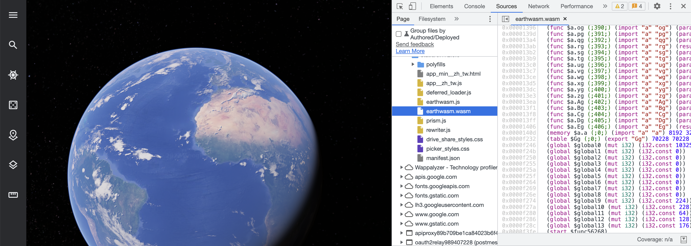

講到Rust也就不得不提到同間公司開發出的 WebAssembly。

WebAssembly是由開發Rust的公司 `Mozilla` 所發展出的一種低階程式語言。
它可以跟 `js` 檔一樣可以在瀏覽器內執行的檔案格式。

WebAssembly的幾個特點
 - 執行速度快
 - 可直接被javascript呼叫函示
 - 都可由主流的低階語言轉換來， `C`, `C++`, `Rust`, `Go` ...
 - 不只可以在網頁上使用，嵌入式裝置也可以

WebAssembly的出現並不是要來取代javascript的，比較偏向的是將運算複雜的功能交由WebAssembly來處理。比方說: 3D繪圖，遊戲引擎 ... 等等之類的。

那麼所謂的WebAssembly程式碼到底長什麼樣子呢？
下面就用官方提供的簡單例子。

```
mod utils;

use wasm_bindgen::prelude::*;

// When the `wee_alloc` feature is enabled, use `wee_alloc` as the global
// allocator.
#[cfg(feature = "wee_alloc")]
#[global_allocator]
static ALLOC: wee_alloc::WeeAlloc = wee_alloc::WeeAlloc::INIT;

#[wasm_bindgen]
extern {
    fn alert(s: &str);
}

#[wasm_bindgen]
pub fn greet() {
    alert("Hello, wasm-game-of-life!");
}
```

這邊import了javscript的api `alert`，並且export了 `greet` 這個function。
接下來執行 `wasm-pack build` 會自動產生轉譯好的 `.wasm`, `.js`, `.ts`檔，在`package.json`進行一些設定後，就可以直接在 `.js` 檔案中 `import` wasm的function了。

```
import * as wasm from "wasm-game-of-life";

wasm.greet();
```

詳情可以看 [這裡](https://rustwasm.github.io/docs/book/game-of-life/hello-world.html)。

目前已經有許多公司實際使用WebAssembly在他們的產品上面了，Google Earth, Figma, Autodesk...等。非常期待這個語言未來的發展。

